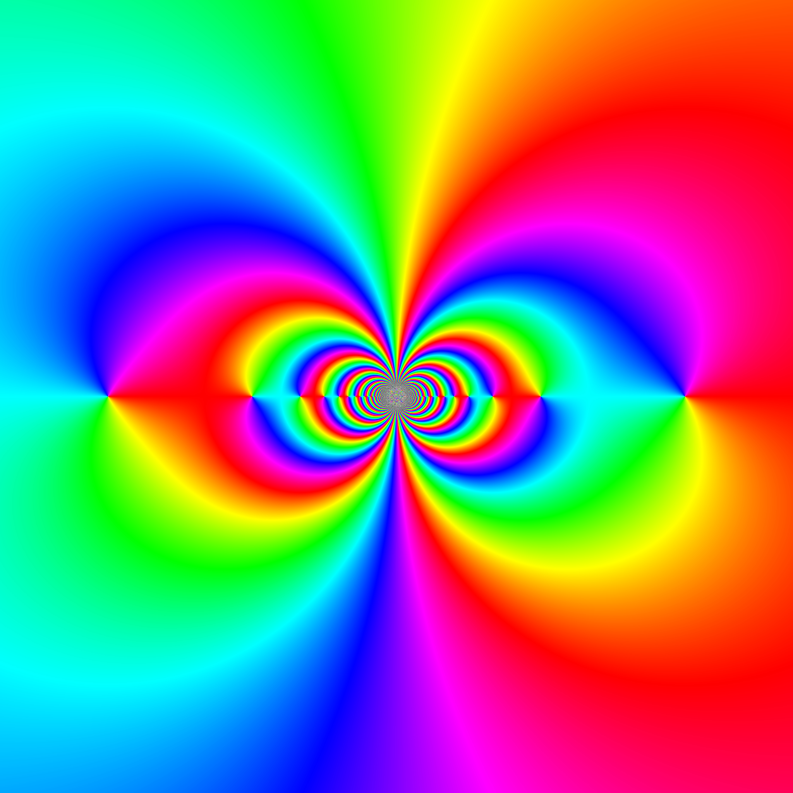

# phase_portraits
ckormanyos/phase_portraits creates beautiful color phase portraits of complex functioins

A series of computer-algebra notebooks are used to creeat vivid, colorful phase portraits of
selected functions in the complex plane. The seminal book on this topic (see [1]) describes
how to make phase plots.

The full selection of phase diagrams can be found in the [images/gallery](./images/gallery)
folder. Each diagram is represented in a colorful $2048{\times}2048$ pixel PNG.

An example is shown below in the image `basic_flat_sin_one_over_z_no_axes.png`.
Here we show the phase portrait of the function

$$
\sin\left(e^{1/z}\right)
$$

for $z=x+iy$ with $-9/16{\le}x{\le}9/16$ and $-9/16{\le}y{\le}9/16$.

[1] E. Wegert, _Visual_ _Complex_ _Functions:_ _An_ _Introduction_ _with_ _Phase_ _Portraits_
(Birkhaeuser/Springer New York, 2012)
